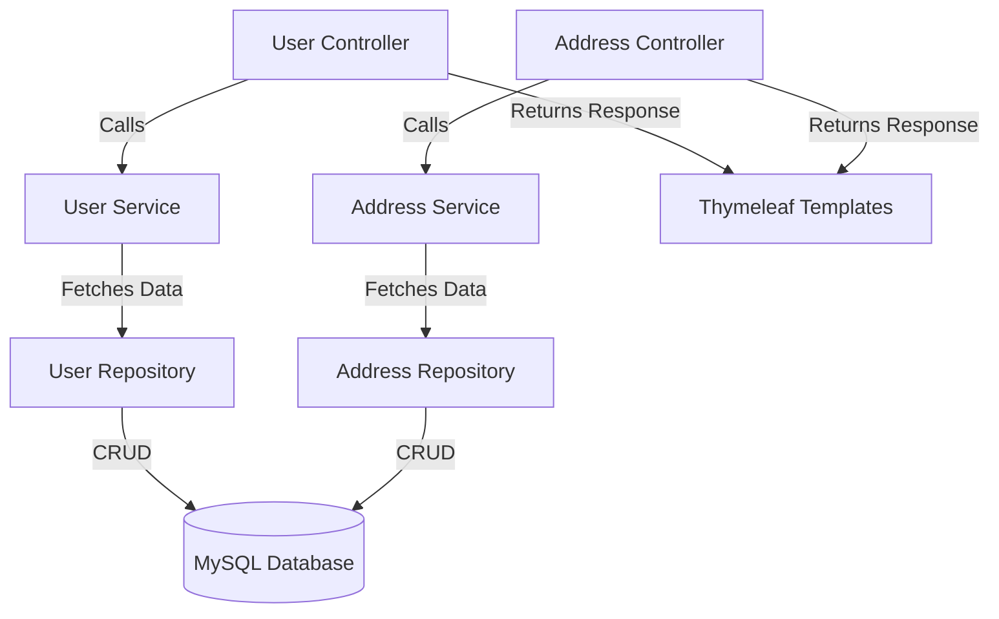
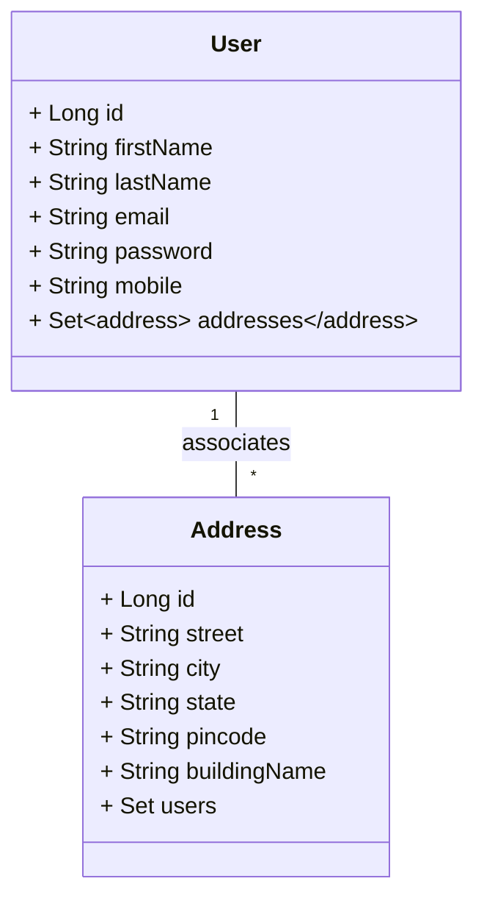

# User Address Management System - Technical Architecture

## Executive Summary
The User Address Management System (UAMS) is designed to streamline the management of users and their addresses, with a focus on efficiency, scalability, and maintainability.
This document outlines the detailed technical architecture based on the latest codebase.

## System Architecture

### Components Overview
The UAMS follows the Model-View-Controller (MVC) design pattern, leveraging Spring Boot for backend services, Thymeleaf for front-end templating, and MySQL for data persistence.

### Component Interaction



## Domain Model
The domain model includes two primary entities: User and Address. Users can have multiple addresses, and addresses can belong to multiple users (Many-to-Many relationship).

### Entity Relationships



## Database Schema

### Tables and Relationships
The MySQL database schema includes tables for users and addresses, with a junction table to manage the many-to-many relationship.

```mermaid
erDiagram
    USERS {
        id BIGINT PRIMARY KEY AUTO_INCREMENT
        first_name VARCHAR(255)
        last_name VARCHAR(255)
        email VARCHAR(255) UNIQUE
        password VARCHAR(255)
        mobile VARCHAR(20)
    }
    
    ADDRESSES {
        id BIGINT PRIMARY KEY AUTO_INCREMENT
        street VARCHAR(255)
        city VARCHAR(255)
        state VARCHAR(255)
        pincode VARCHAR(20)
        building_name VARCHAR(255)
    }
    
    USERS_ADDRESSES {
        user_id BIGINT
        address_id BIGINT
        PRIMARY KEY(user_id, address_id)
    }
    
    USERS_ADDRESSES {
        FOREIGN KEY(user_id) REFERENCES USERS(id)
        FOREIGN KEY(address_id) REFERENCES ADDRESSES(id)
    }
```

## API Design

### User API
- **GET /users**: Retrieve all users
- **POST /users**: Create a new user
- **PUT /users/{id}**: Update user details
- **DELETE /users/{id}**: Delete a user
- **GET /users/{id}/addresses**: Retrieve addresses associated with a user

### Address API
- **GET /addresses**: Retrieve all addresses
- **POST /addresses**: Create a new address
- **PUT /addresses/{id}**: Update address details
- **DELETE /addresses/{id}**: Delete an address
- **POST /addresses/associate**: Associate address with a user
- **POST /addresses/dissociate**: Dissociate address from a user

## Implementation Details
### Technologies and Frameworks Used
- **Spring Boot 2.7.0**: Backend framework
- **Java 11**: Programming language
- **Thymeleaf**: Templating engine
- **Bootstrap 5.1.3**: Front-end framework
- **MySQL 8.0.33**: Database
- **Lombok**: Reduces boilerplate code
- **Spring Data JPA**: Data access layer

## Security Considerations
- **Authentication**: User credential validation during creation and updates
- **Authorization**: Secure access to user and address management functionalities
- **Data Validation**: Prevent SQL injection and ensure safe data handling

## Future Enhancements
### Orders and Products Management
- Implement order management functionalities
  - Create orders
  - List user orders
- Implement product management functionalities
  - Product catalog
  - Inventory management

### Docker Integration
- Containerize the application for better scalability and deployment

### Unit Testing
- Enhance test coverage using JUnit and Mockito for unit tests

### Continuous Integration
- Setup CI/CD pipelines using Jenkins or GitHub Actions
